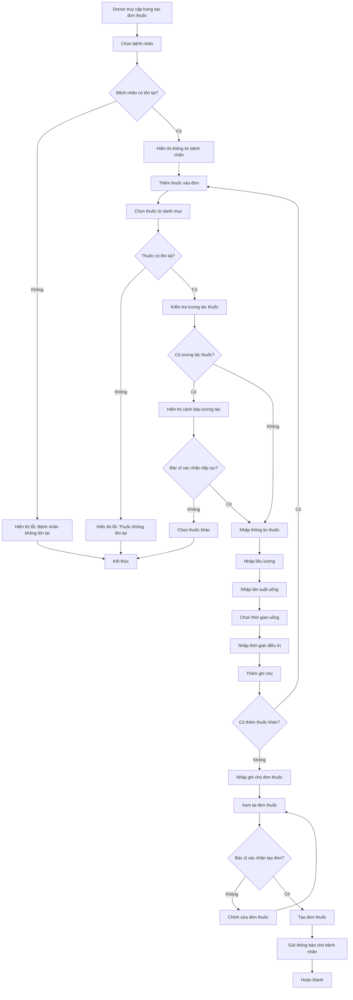
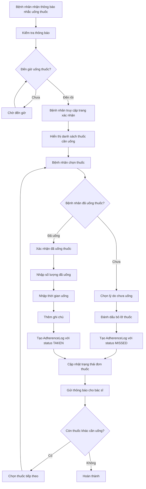
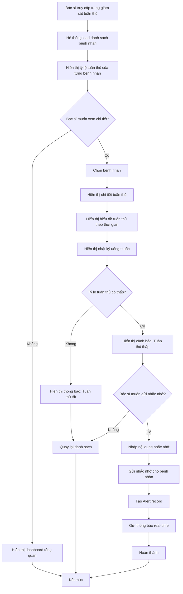
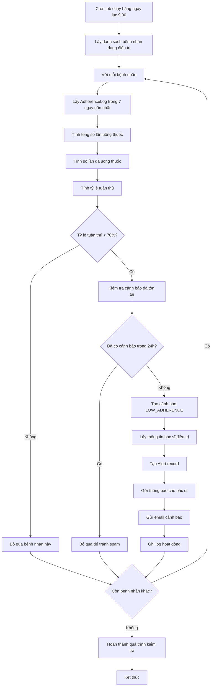
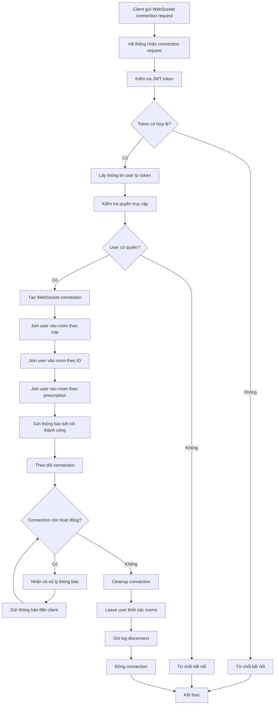
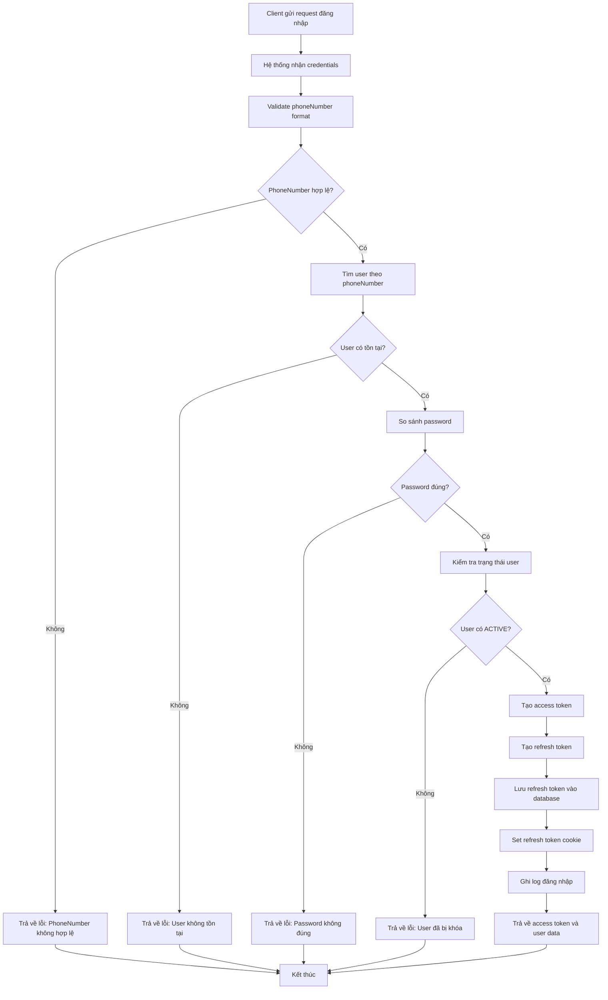

# UML Activity Diagrams - Medical Management System

## Tổng Quan
Sơ đồ hoạt động UML mô tả các quy trình nghiệp vụ và luồng công việc trong hệ thống quản lý y tế.

## 1. Activity Diagram - Quy Trình Kê Đơn Thuốc

## 2. Activity Diagram - Quy Trình Uống Thuốc của Bệnh Nhân

## 3. Activity Diagram - Quy Trình Giám Sát Tuân Thủ

## 4. Activity Diagram - Quy Trình Tạo Cảnh Báo Tự Động

## 5. Activity Diagram - Quy Trình Xử Lý WebSocket Connection

## 6. Activity Diagram - Quy Trình Authentication

## Mô Tả Chi Tiết

### 1. Quy Trình Kê Đơn Thuốc
- **Mục đích**: Mô tả quy trình bác sĩ tạo đơn thuốc điện tử
- **Các bước chính**:
  1. Chọn bệnh nhân và validate
  2. Thêm thuốc và kiểm tra tương tác
  3. Nhập thông tin chi tiết thuốc
  4. Xem lại và xác nhận đơn thuốc
  5. Tạo đơn thuốc và gửi thông báo

### 2. Quy Trình Uống Thuốc của Bệnh Nhân
- **Mục đích**: Mô tả quy trình bệnh nhân uống thuốc và xác nhận
- **Các bước chính**:
  1. Nhận thông báo nhắc uống thuốc
  2. Xác nhận đã uống hoặc đánh dấu bỏ lỡ
  3. Tạo AdherenceLog record
  4. Cập nhật trạng thái đơn thuốc
  5. Gửi thông báo cho bác sĩ

### 3. Quy Trình Giám Sát Tuân Thủ
- **Mục đích**: Mô tả quy trình bác sĩ giám sát tuân thủ uống thuốc
- **Các bước chính**:
  1. Xem danh sách bệnh nhân và tỷ lệ tuân thủ
  2. Xem chi tiết tuân thủ của từng bệnh nhân
  3. Phát hiện tuân thủ thấp
  4. Gửi nhắc nhở cho bệnh nhân
  5. Tạo cảnh báo và thông báo

### 4. Quy Trình Tạo Cảnh Báo Tự Động
- **Mục đích**: Mô tả quy trình hệ thống tự động tạo cảnh báo
- **Các bước chính**:
  1. Cron job chạy hàng ngày
  2. Tính tỷ lệ tuân thủ cho từng bệnh nhân
  3. Phát hiện tuân thủ thấp
  4. Tạo cảnh báo và gửi cho bác sĩ
  5. Ghi log hoạt động

### 5. Quy Trình Xử Lý WebSocket Connection
- **Mục đích**: Mô tả quy trình quản lý kết nối WebSocket
- **Các bước chính**:
  1. Xác thực JWT token
  2. Tạo WebSocket connection
  3. Join user vào các rooms
  4. Xử lý thông báo real-time
  5. Cleanup khi disconnect

### 6. Quy Trình Authentication
- **Mục đích**: Mô tả quy trình đăng nhập và xác thực
- **Các bước chính**:
  1. Validate thông tin đăng nhập
  2. Kiểm tra user và password
  3. Tạo access token và refresh token
  4. Set cookie và ghi log
  5. Trả về kết quả đăng nhập

## Lợi Ích Của Activity Diagrams

1. **Hiểu rõ quy trình**: Giúp hiểu rõ quy trình nghiệp vụ từ đầu đến cuối
2. **Phát hiện lỗi**: Dễ dàng phát hiện các điểm có thể xảy ra lỗi
3. **Tối ưu hóa**: Hỗ trợ tối ưu hóa quy trình nghiệp vụ
4. **Tài liệu hóa**: Tài liệu hóa quy trình cho team phát triển
5. **Giao tiếp**: Giúp giao tiếp giữa team về quy trình nghiệp vụ
6. **Testing**: Hỗ trợ thiết kế test cases cho quy trình
