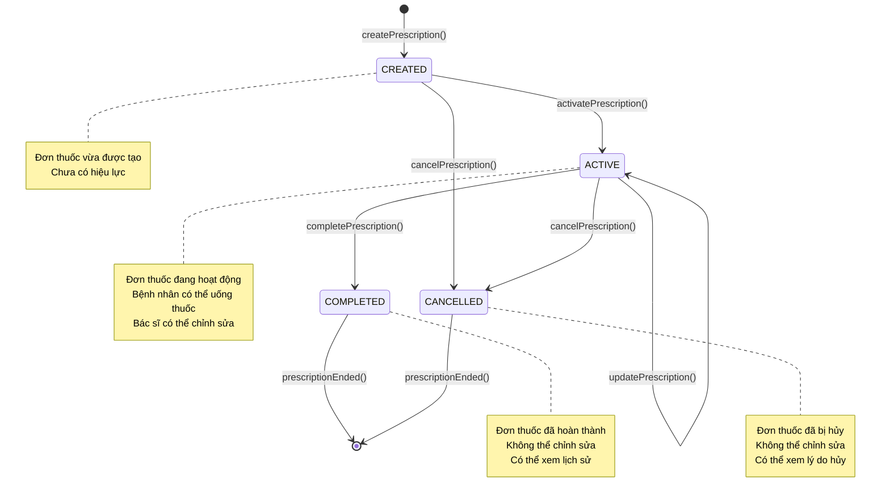
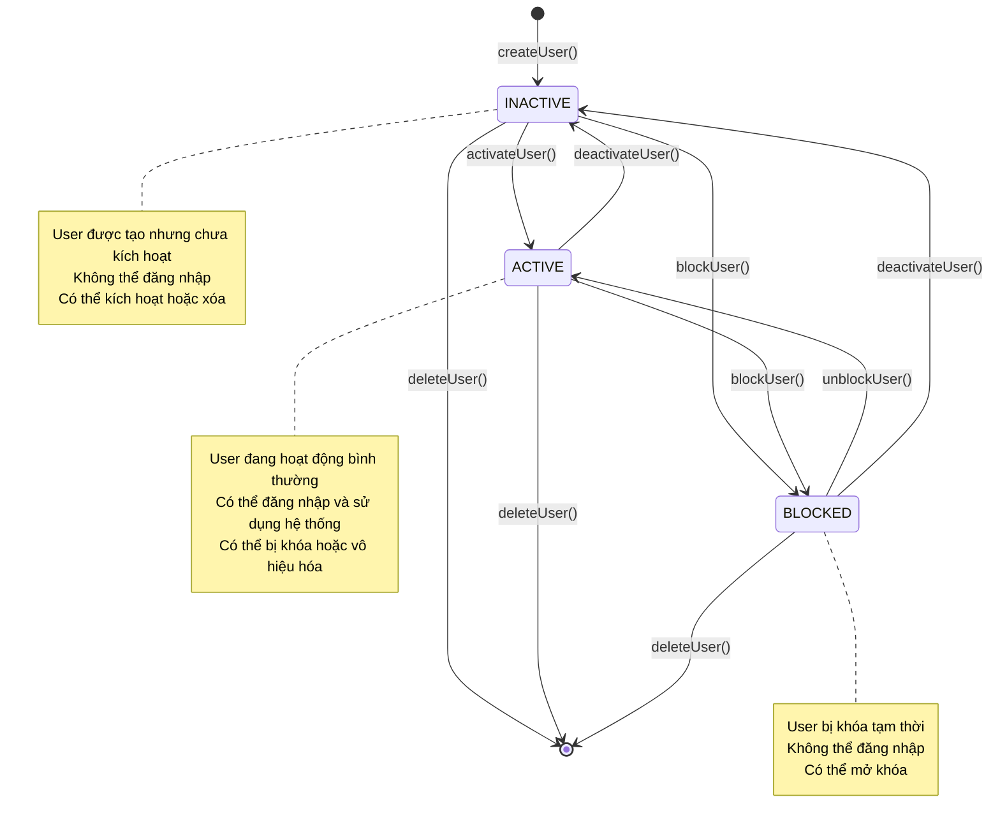
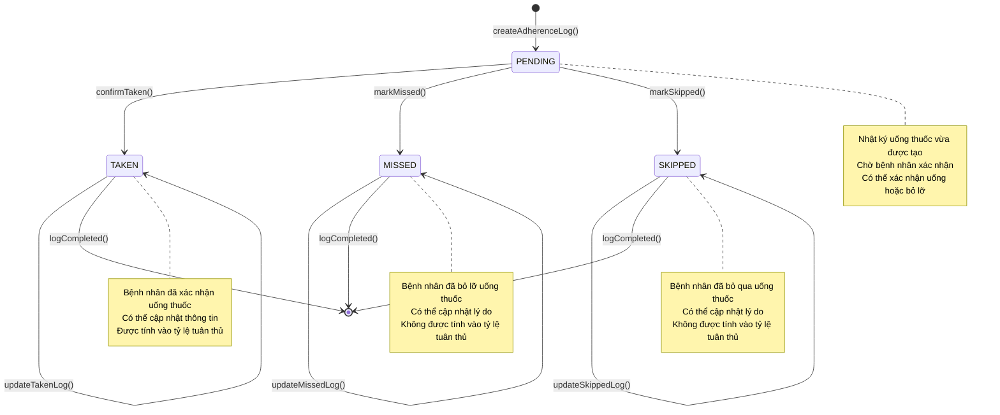
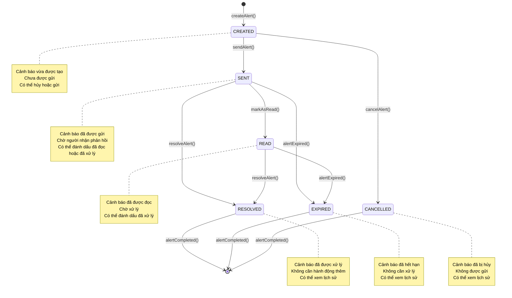
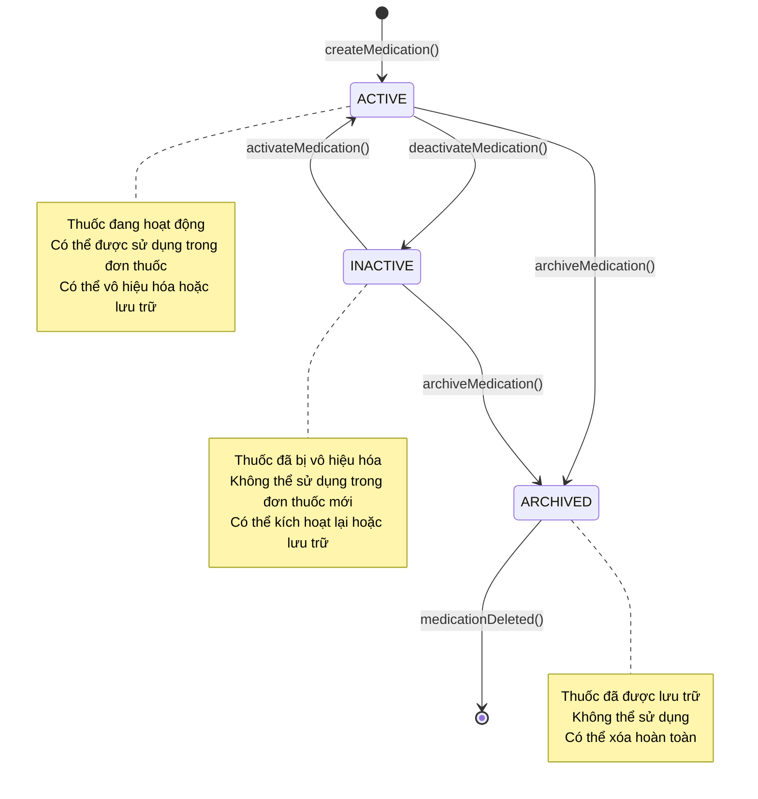
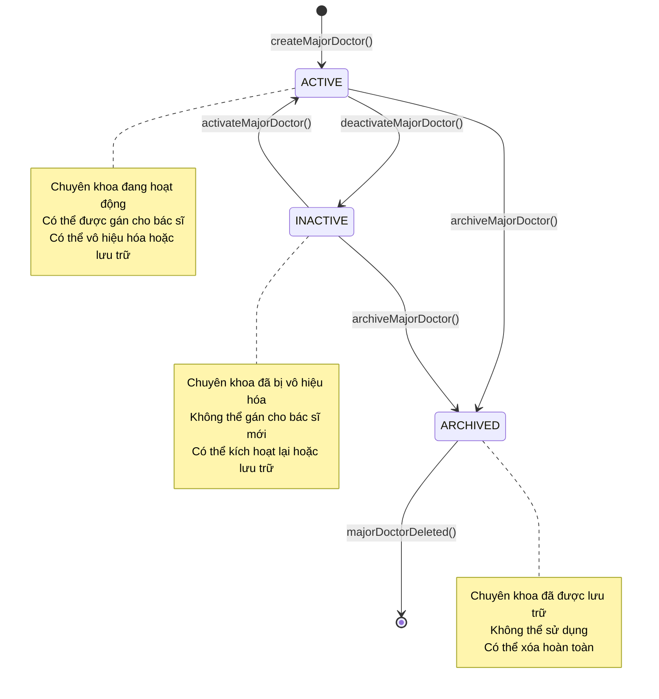
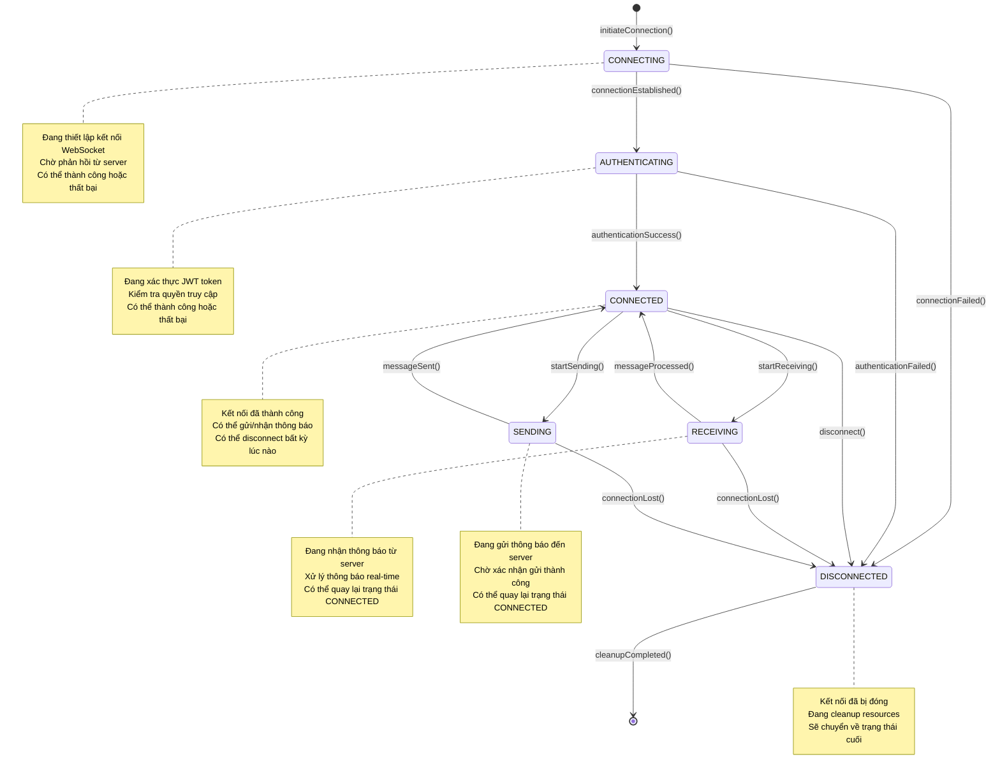

# UML State Machine Diagrams - Medical Management System

## Tổng Quan
Sơ đồ trạng thái UML mô tả các trạng thái và chuyển đổi trạng thái của các đối tượng quan trọng trong hệ thống quản lý y tế.

## 1. State Machine Diagram - Prescription States

## 2. State Machine Diagram - User States

## 3. State Machine Diagram - AdherenceLog States

## 4. State Machine Diagram - Alert States

## 5. State Machine Diagram - Medication States

## 6. State Machine Diagram - MajorDoctor States

## 7. State Machine Diagram - WebSocket Connection States

## Mô Tả Chi Tiết

### 1. Prescription States
- **CREATED**: Đơn thuốc vừa được tạo, chưa có hiệu lực
- **ACTIVE**: Đơn thuốc đang hoạt động, bệnh nhân có thể uống thuốc
- **COMPLETED**: Đơn thuốc đã hoàn thành, không thể chỉnh sửa
- **CANCELLED**: Đơn thuốc đã bị hủy, không thể chỉnh sửa

### 2. User States
- **INACTIVE**: User được tạo nhưng chưa kích hoạt
- **ACTIVE**: User đang hoạt động bình thường
- **BLOCKED**: User bị khóa tạm thời

### 3. AdherenceLog States
- **PENDING**: Nhật ký uống thuốc vừa được tạo, chờ xác nhận
- **TAKEN**: Bệnh nhân đã xác nhận uống thuốc
- **MISSED**: Bệnh nhân đã bỏ lỡ uống thuốc
- **SKIPPED**: Bệnh nhân đã bỏ qua uống thuốc

### 4. Alert States
- **CREATED**: Cảnh báo vừa được tạo, chưa được gửi
- **SENT**: Cảnh báo đã được gửi, chờ phản hồi
- **READ**: Cảnh báo đã được đọc, chờ xử lý
- **RESOLVED**: Cảnh báo đã được xử lý
- **EXPIRED**: Cảnh báo đã hết hạn
- **CANCELLED**: Cảnh báo đã bị hủy

### 5. Medication States
- **ACTIVE**: Thuốc đang hoạt động, có thể sử dụng
- **INACTIVE**: Thuốc đã bị vô hiệu hóa
- **ARCHIVED**: Thuốc đã được lưu trữ

### 6. MajorDoctor States
- **ACTIVE**: Chuyên khoa đang hoạt động
- **INACTIVE**: Chuyên khoa đã bị vô hiệu hóa
- **ARCHIVED**: Chuyên khoa đã được lưu trữ

### 7. WebSocket Connection States
- **CONNECTING**: Đang thiết lập kết nối
- **AUTHENTICATING**: Đang xác thực
- **CONNECTED**: Kết nối đã thành công
- **RECEIVING**: Đang nhận thông báo
- **SENDING**: Đang gửi thông báo
- **DISCONNECTED**: Kết nối đã bị đóng

## Lợi Ích Của State Machine Diagrams

1. **Hiểu rõ trạng thái**: Giúp hiểu rõ các trạng thái và chuyển đổi trạng thái
2. **Thiết kế logic**: Hỗ trợ thiết kế logic xử lý trạng thái
3. **Phát hiện lỗi**: Dễ dàng phát hiện các trạng thái không hợp lệ
4. **Tài liệu hóa**: Tài liệu hóa các trạng thái cho team phát triển
5. **Testing**: Hỗ trợ thiết kế test cases cho các trạng thái
6. **Giao tiếp**: Giúp giao tiếp giữa team về logic trạng thái
