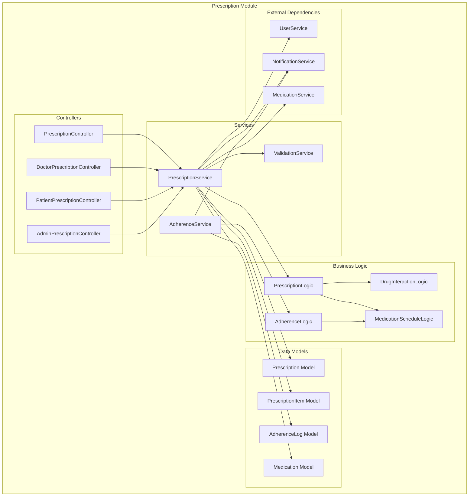
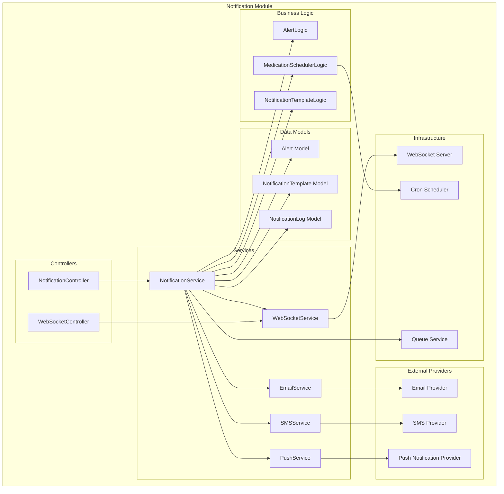
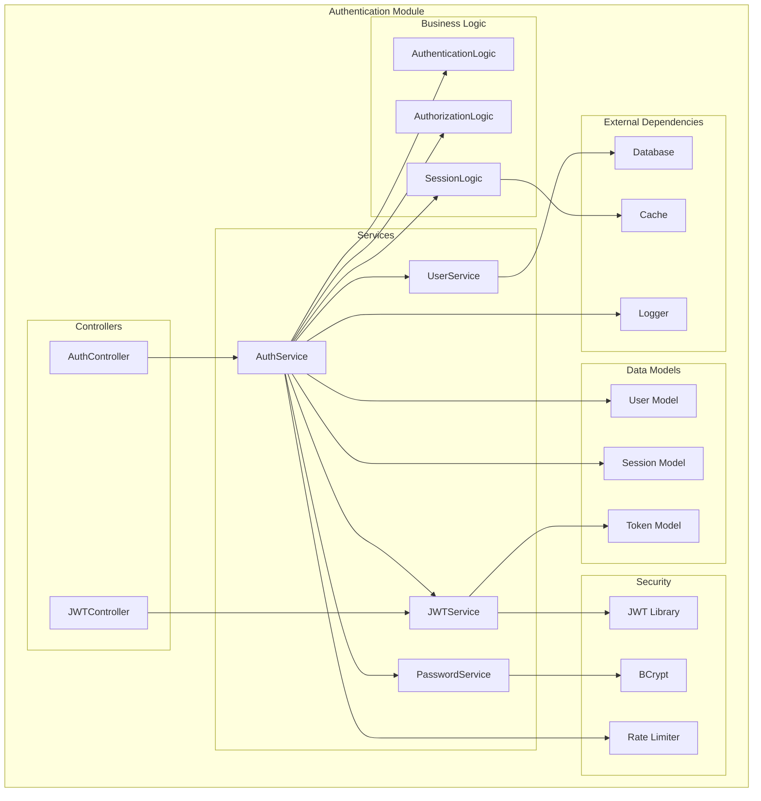
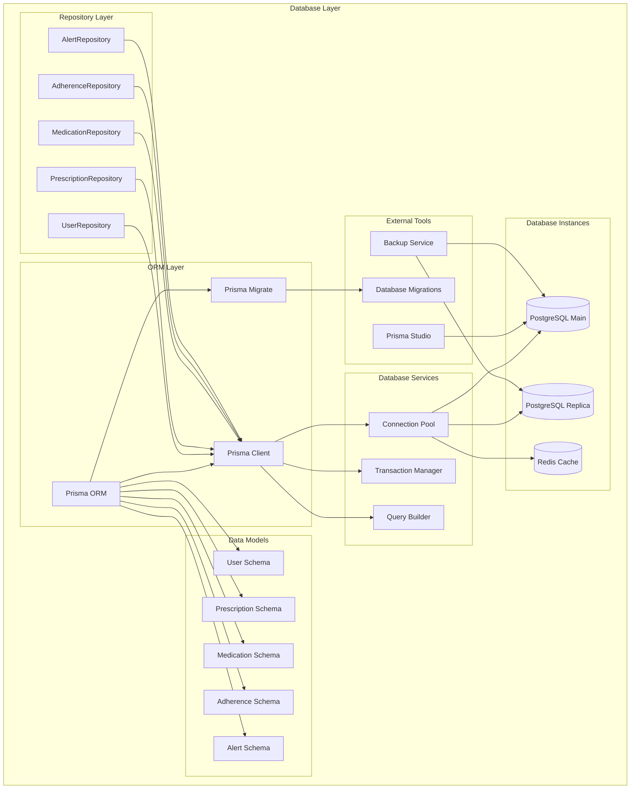

# UML Component Diagrams - Medical Management System

## Tổng Quan
Sơ đồ thành phần UML mô tả cấu trúc các thành phần và mối quan hệ giữa chúng trong hệ thống quản lý y tế.

## 1. Component Diagram - System Architecture

```mermaid
graph TB
    subgraph "Frontend Layer"
        FE[React Frontend]
        UI[UI Components]
        API_CLIENT[API Client]
    end
    
    subgraph "API Gateway Layer"
        GW[API Gateway]
        AUTH_GW[Authentication Gateway]
        RATE_LIMIT[Rate Limiting]
    end
    
    subgraph "Application Layer"
        subgraph "Controllers"
            AUTH_CTRL[AuthController]
            USER_CTRL[UserController]
            PRESC_CTRL[PrescriptionController]
            DOCTOR_CTRL[DoctorController]
            PATIENT_CTRL[PatientController]
            NOTIF_CTRL[NotificationController]
            REPORT_CTRL[ReportController]
        end
        
        subgraph "Services"
            AUTH_SVC[AuthService]
            USER_SVC[UserService]
            PRESC_SVC[PrescriptionService]
            NOTIF_SVC[NotificationService]
            REPORT_SVC[ReportService]
            EMAIL_SVC[EmailService]
            SMS_SVC[SMSService]
        end
        
        subgraph "Business Logic"
            PRESC_LOGIC[PrescriptionLogic]
            ADHERENCE_LOGIC[AdherenceLogic]
            ALERT_LOGIC[AlertLogic]
            SCHEDULER[MedicationScheduler]
        end
    end
    
    subgraph "Data Access Layer"
        PRISMA[Prisma ORM]
        REPO[Repository Pattern]
        CACHE[Redis Cache]
    end
    
    subgraph "Database Layer"
        POSTGRES[(PostgreSQL Database)]
        REDIS[(Redis Cache)]
    end
    
    subgraph "External Services"
        EMAIL_PROVIDER[Email Provider]
        SMS_PROVIDER[SMS Provider]
        PUSH_SERVICE[Push Notification Service]
    end
    
    subgraph "Infrastructure"
        WEBSOCKET[WebSocket Server]
        CRON[Cron Jobs]
        LOGGER[Logger Service]
        MONITOR[Monitoring Service]
    end
    
    %% Frontend connections
    FE --> UI
    FE --> API_CLIENT
    API_CLIENT --> GW
    
    %% API Gateway connections
    GW --> AUTH_GW
    GW --> RATE_LIMIT
    GW --> AUTH_CTRL
    GW --> USER_CTRL
    GW --> PRESC_CTRL
    GW --> DOCTOR_CTRL
    GW --> PATIENT_CTRL
    GW --> NOTIF_CTRL
    GW --> REPORT_CTRL
    
    %% Controller to Service connections
    AUTH_CTRL --> AUTH_SVC
    USER_CTRL --> USER_SVC
    PRESC_CTRL --> PRESC_SVC
    DOCTOR_CTRL --> PRESC_SVC
    PATIENT_CTRL --> PRESC_SVC
    NOTIF_CTRL --> NOTIF_SVC
    REPORT_CTRL --> REPORT_SVC
    
    %% Service to Business Logic connections
    PRESC_SVC --> PRESC_LOGIC
    PRESC_SVC --> ADHERENCE_LOGIC
    NOTIF_SVC --> ALERT_LOGIC
    NOTIF_SVC --> SCHEDULER
    
    %% Service to External connections
    NOTIF_SVC --> EMAIL_SVC
    NOTIF_SVC --> SMS_SVC
    EMAIL_SVC --> EMAIL_PROVIDER
    SMS_SVC --> SMS_PROVIDER
    NOTIF_SVC --> PUSH_SERVICE
    
    %% Data Access connections
    AUTH_SVC --> PRISMA
    USER_SVC --> PRISMA
    PRESC_SVC --> PRISMA
    NOTIF_SVC --> PRISMA
    REPORT_SVC --> PRISMA
    
    PRISMA --> REPO
    REPO --> POSTGRES
    REPO --> CACHE
    CACHE --> REDIS
    
    %% Infrastructure connections
    WEBSOCKET --> NOTIF_SVC
    CRON --> SCHEDULER
    LOGGER --> AUTH_SVC
    LOGGER --> USER_SVC
    LOGGER --> PRESC_SVC
    LOGGER --> NOTIF_SVC
    MONITOR --> AUTH_SVC
    MONITOR --> USER_SVC
    MONITOR --> PRESC_SVC
    MONITOR --> NOTIF_SVC
```

## 2. Component Diagram - Prescription Module

## 3. Component Diagram - Notification Module

## 4. Component Diagram - Authentication Module

## 5. Component Diagram - Database Layer

## Mô Tả Chi Tiết

### 1. System Architecture Component Diagram
- **Frontend Layer**: React frontend với UI components và API client
- **API Gateway Layer**: API gateway với authentication và rate limiting
- **Application Layer**: Controllers, Services, và Business Logic
- **Data Access Layer**: Prisma ORM với Repository pattern và Redis cache
- **Database Layer**: PostgreSQL database và Redis cache
- **External Services**: Email, SMS, và Push notification providers
- **Infrastructure**: WebSocket server, Cron jobs, Logger, và Monitoring

### 2. Prescription Module Component Diagram
- **Controllers**: Các controller cho prescription management
- **Services**: PrescriptionService, AdherenceService, ValidationService
- **Business Logic**: PrescriptionLogic, AdherenceLogic, DrugInteractionLogic
- **Data Models**: Prescription, PrescriptionItem, AdherenceLog, Medication models
- **External Dependencies**: UserService, NotificationService, MedicationService

### 3. Notification Module Component Diagram
- **Controllers**: NotificationController và WebSocketController
- **Services**: NotificationService, EmailService, SMSService, PushService
- **Business Logic**: AlertLogic, MedicationSchedulerLogic, NotificationTemplateLogic
- **Data Models**: Alert, NotificationTemplate, NotificationLog models
- **External Providers**: Email, SMS, và Push notification providers
- **Infrastructure**: WebSocket server, Cron scheduler, Queue service

### 4. Authentication Module Component Diagram
- **Controllers**: AuthController và JWTController
- **Services**: AuthService, JWTService, UserService, PasswordService
- **Business Logic**: AuthenticationLogic, AuthorizationLogic, SessionLogic
- **Data Models**: User, Session, Token models
- **Security**: JWT library, BCrypt, Rate limiter
- **External Dependencies**: Database, Cache, Logger

### 5. Database Layer Component Diagram
- **ORM Layer**: Prisma ORM với client và migrate
- **Repository Layer**: Các repository cho từng entity
- **Database Services**: Connection pool, Transaction manager, Query builder
- **Data Models**: Các schema cho từng entity
- **Database Instances**: PostgreSQL main/replica và Redis cache
- **External Tools**: Prisma Studio, Database migrations, Backup service

## Lợi Ích Của Component Diagrams

1. **Hiểu rõ kiến trúc**: Giúp hiểu rõ kiến trúc hệ thống và các thành phần
2. **Thiết kế hệ thống**: Hỗ trợ thiết kế và phát triển hệ thống
3. **Tài liệu hóa**: Tài liệu hóa kiến trúc cho team phát triển
4. **Bảo trì**: Dễ dàng bảo trì và mở rộng hệ thống
5. **Giao tiếp**: Giúp giao tiếp giữa team về kiến trúc hệ thống
6. **Testing**: Hỗ trợ thiết kế test cases cho từng thành phần
